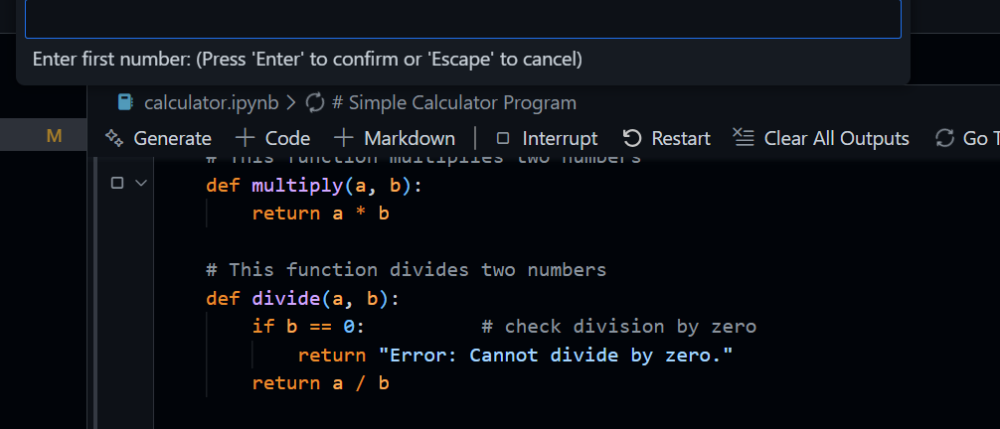
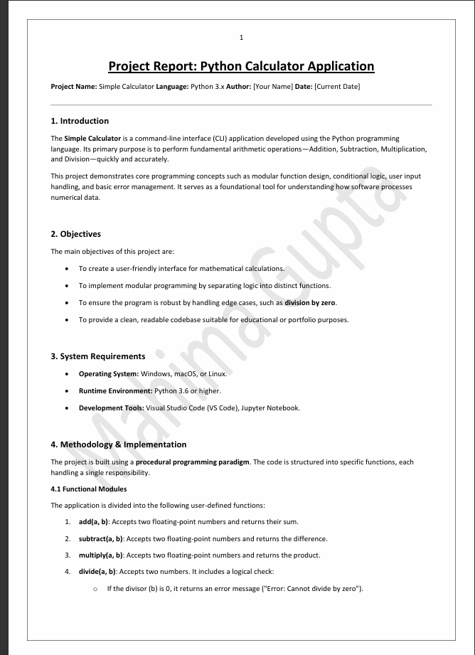

# Calculator Project for Data Analysis 

A robust Python-based calculator tool designed specifically for data analysis workflows. This project demonstrates modular coding, arithmetic logic, and comprehensive documentation.

---

##  Documentation
**[Click here to read the full Project Report (PDF) ↗](./calculator%20report.pdf)**
*Contains detailed analysis, logic flowcharts, and testing results.*

---

##  Project Previews

### 1. Analysis Output
A demonstration of the calculator performing operations:

### 2. Report Cover
The formal documentation included in this repository:

---

##  Key Features
* **Arithmetic Logic:** Custom functions to handle mathematical operations.
* **Error Handling:** Robust mechanisms to prevent crashes (e.g., division by zero).
* **Data Analysis Focus:** Designed to assist in quick numerical processing.
* **Interactive Interface:** Built using Jupyter Notebooks for immediate feedback.

---

##  Repository Structure
| File / Folder | Description |
| :--- | :--- |
| **`Calculator App/`** | Contains the source code (`.ipynb` files). |
| **`calculator report.pdf`** | The formal project analysis and documentation. |
| **`Assets/`** | Screenshots and project images. |

---

##  How to Run
1.  Clone or download this repository.
2.  Navigate to the `Calculator App` folder.
3.  Open the notebook in **VS Code** or **Jupyter**.
4.  Run all cells to start the calculator.

---

##  Author
**Mahima Gupta**
* *Developer & Analyst*
